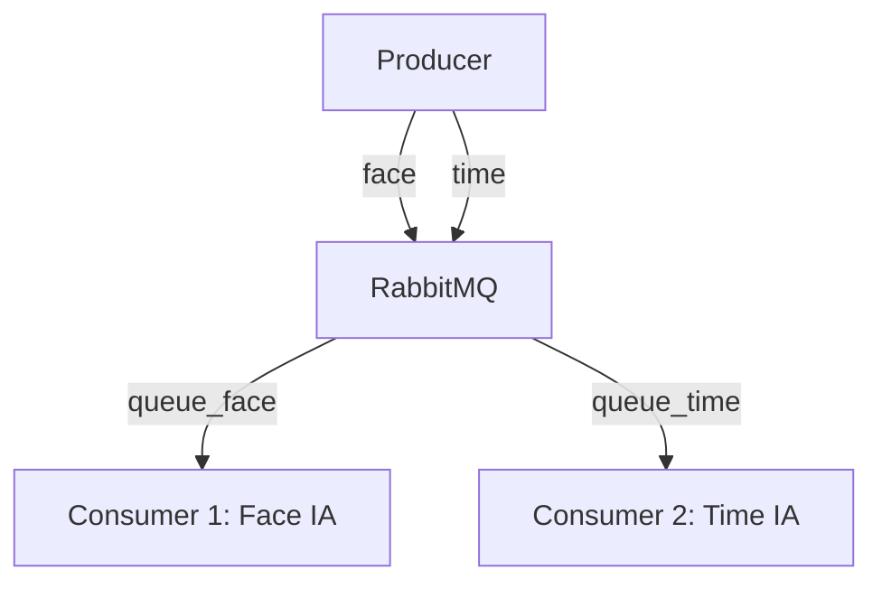

# 📦 Sistema Distribuído com RabbitMQ e IA nos Consumidores

Este projeto implementa um sistema distribuído composto por **4 containers**: um produtor de imagens, dois consumidores com IA embutida (reconhecimento facial e brasão de time), e um broker de mensagens **RabbitMQ**. A comunicação entre os serviços ocorre via filas, utilizando **Exchange do tipo `topic`**.

## 📋 Objetivo

Atender à **Atividade 6** da disciplina de Sistemas Distribuídos, construindo um sistema containerizado que:

- Gera mensagens com alta frequência (5/s)
- Utiliza RabbitMQ como intermediário (broker)
- Contém dois consumidores, cada um com uma IA específica
- Demonstra crescimento de filas quando o consumo for mais lento que a produção

---

## 🧠 Arquitetura



---

## 🐳 Containers

1. **RabbitMQ**
   - Broker de mensagens.
   - Interface web em `http://localhost:15672` (login: guest / senha: guest).

2. **Producer**
   - Envia imagens aleatórias de rostos e escudos de time.
   - Gera mensagens com routing keys: `face` ou `time`.

3. **Consumer 1 (Face)**
   - Consome da fila `queue_face`.
   - Classifica a imagem como `Feliz` ou `Triste`.

4. **Consumer 2 (Time)**
   - Consome da fila `queue_time`.
   - Classifica a imagem como `Flamengo` ou `Corinthians`.

---

## 📂 Estrutura de Pastas

```
Trabalho-6-Sistemas-Distribuidos/
├── consumer_1/
│   ├── consumer_1.py              # Script com a IA de reconhecimento facial
│   ├── imagens_face/              # Subpastas com imagens de treino/teste: Feliz/, Triste/
│   ├── Dockerfile                 # Dockerfile para build do container consumer_1
│   └── requirements.txt           # Dependências da IA facial
│
├── consumer_2/
│   ├── consumer_2.py              # Script com a IA de identificação de time
│   ├── imagens_time/              # Subpastas com imagens de treino/teste: Flamengo/, Corinthians/
│   ├── Dockerfile                 # Dockerfile para build do container consumer_2
│   └── requirements.txt           # Dependências da IA de times
│
├── Prints/                        # Imagens do Funcionamento do Proejeto
│   
├── producer/
│   ├── produtor.py                # Envia imagens com routing key 'face' ou 'time'
│   ├── imagens/                   # Contém imagens como face_001.jpg, time_001.jpg
│   ├── Dockerfile                 # Dockerfile para build do container producer
│   └── requirements.txt           # Dependências do produtor
│
├── docker-compose.yml             # Orquestração dos containers com RabbitMQ
├── .gitattributes                 # Configurações de Git específicas do projeto
├── LICENSE                        # Licença do projeto
└── README.md                      # Documentação principal (este arquivo)

```

---

## 🧪 Inteligência Artificial

- Ambas as IAs usam o modelo **KNeighborsClassifier** do `scikit-learn`.
- As imagens são convertidas para tons de cinza e redimensionadas para **32x32 pixels**.
- Os modelos são **salvos em disco (`.pkl`)** após o primeiro treinamento.
- Cada IA só será treinada se o modelo ainda não existir (evita retrabalho).

---

## ⚙️ Como Executar

### Pré-requisitos

- Docker e Docker Compose instalados.

### Passos

1. Clone o repositório ou baixe o zip do projeto.

2. Certifique-se de que as pastas de imagem estejam preenchidas:
   - `producer/imagens/` com arquivos como `face_001.jpg`, `time_001.jpg`
   - `consumer_1/imagens_face/Feliz/` e `Triste/`
   - `consumer_2/imagens_time/Flamengo/` e `Corinthians/`

3. Construa e inicie os containers:

   ```
    3.1 cd Trabalho-6-Sistemas-Distribuidos
    3.2 docker-compose up --build 
   ```

4. Acesse o painel RabbitMQ:
   - URL: [http://localhost:15672](http://localhost:15672)
   - Login: `guest` | Senha: `guest`

---

## 🛰️ Mensagens e Roteamento

- O **Producer** publica imagens com base no prefixo do nome do arquivo:
  - `face_*.jpg` → routing key: `face`
  - `time_*.jpg` → routing key: `time`

- O **Exchange** é do tipo `topic`, com as seguintes configurações:
  - `queue_face` → recebe mensagens com `routing_key = face`
  - `queue_time` → recebe mensagens com `routing_key = time`

---

## 🕵️‍♂️ Observações Importantes

- Os **consumidores são mais lentos que o produtor** (0.5s de delay), então:
  - As filas devem crescer com o tempo.
  - Isso pode ser monitorado via interface do RabbitMQ.

- O uso do `joblib` garante que o modelo treinado seja reaproveitado entre execuções.

---

## 📸 Exemplos de Saída

```bash
[x] Enviada 'face_001.jpg' pela rota 'face'
[FACE] face_001.jpg → Face detectada como: Feliz

[x] Enviada 'time_002.jpg' pela rota 'time'
[TIME] time_002.jpg → Time identificado: Corinthians
```

---

## 📸 Prints do funcionamento
### ✔️ Interface de filas no RabbitMQ
Fila com consumidores conectados:


#### Explicação dos Campos
Publicar (Publish) 🟡 – Número de mensagens enviadas para a fila.

Entregar (manual ack) 🔵 – Mensagens entregues a consumidores que reconhecem manualmente.

Entregar (auto ack) 🔴 – Mensagens entregues a consumidores com reconhecimento automático.

Reconhecimento do consumidor (Consumer ack) 🟢 – Mensagens que os consumidores confirmaram ter processado.

Reentregue (Redelivered) 🟣 – Mensagens reenviadas para consumidores após falhas ou não reconhecimento.

Obter (auto ack) ⚫ – Mensagens recebidas automaticamente pelos consumidores.

Obter (vazio) 🟠 – Tentativas de buscar mensagens na fila, mas sem sucesso.

### 📊 Overview de desempenho
Visualização geral da troca de mensagens:


#### Gráfico de Mensagens Enfileiradas (Queued messages last minute)
Este gráfico mostra a variação da quantidade de mensagens na fila ao longo do último minuto:

`Linha vermelha ("Unacked")`: Representa mensagens que foram entregues aos consumidores, mas ainda não receberam confirmação (ack). Neste caso, há 59 mensagens pendentes, o que indica um fluxo lento no processamento.

`Linha azul ("Ready")`: Representa mensagens prontas para consumo imediato. O valor é 0, sugerindo que todas as mensagens foram atribuídas aos consumidores.

`Total de mensagens`: Soma das categorias anteriores (Ready + Unacked). No gráfico, o total é 59, refletindo o atraso na confirmação por parte dos consumidores.

#### Gráfico de Taxa de Mensagens (Message rates last minute)
Este gráfico detalha a frequência com que diferentes eventos ocorrem na fila queue_face:

`Linha amarela ("Publish")`: Representa a taxa de publicação de novas mensagens pelo Producer. A taxa atual é de 2.6 mensagens por segundo.

`Linha azul clara ("Deliver (manual ack)")`: Indica a taxa de entrega de mensagens aos consumidores. A taxa de entrega é também de 2.6 mensagens por segundo, o que coincide com a taxa de publicação.

`Linha verde ("Consumer ack")`: Indica a confirmação (ack) de processamento das mensagens pelos consumidores. O ritmo é de 1.4 mensagens por segundo, o que significa que há um déficit de processamento, pois menos mensagens estão sendo confirmadas do que entregues.

`Linha roxa ("Redelivered")`: Indica o número de mensagens que precisaram ser reenviadas aos consumidores. O valor é 0, sugerindo que não houve necessidade de reenvios.

### 🧠 Comportamento da IA – Consumer 1 (Face)


### 🧠 Comportamento da IA – Consumer 2 (Time)


## 🧼 Para Parar

```
docker-compose down
```

---

## 📎 Referências

- [RabbitMQ Official Docs](https://www.rabbitmq.com/)
- [scikit-learn](https://scikit-learn.org/)
- [OpenCV](https://opencv.org/)
- [joblib](https://joblib.readthedocs.io/)

---

## Contribuidores
Luis Eduardo

Francisco Aparício

Victor Macêdo
